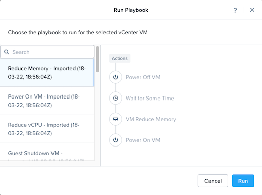
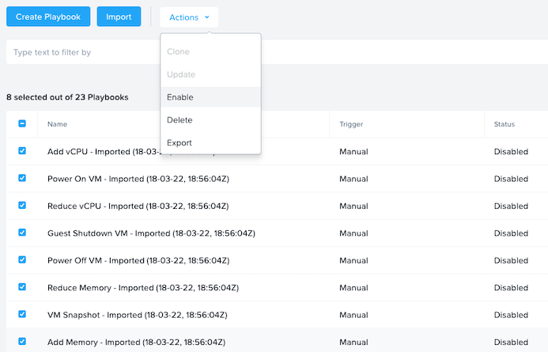

# External vCenter actions

### Export Version
<b>pc.2022.1</b> - This playbook can only be imported into pc.2022.1 or newer versions.

### Description

This is a set of 8 playbooks developed in pc.2022.1 for performing actions on external vCenter VMs managed by Prism Central. The playbooks all use the manual trigger on the vCenter VM entity and do the following actions:

1. Reduce Memory
    - Power Off VM (Guest Shutdown)
    - Wait 1 minute
    - Reduce memory by 1 GiB to a minimum of 1 GiB
    - Power On VM
2. Reduce vCPU
   - Power Off VM (Guest Shutdown) 
   - Wait 1 minute
   - Reduce vCPU by 1 to a minimum of 1 vCPU
   - Power On VM
3. Add memory (note: Memory Hot Add must be enabled for the VM in vCenter)
   - Increase memory by 1 GiB to a maximum of 20 GiB
4. Add vCPU
   - Increase vCPUs by 1 to a maximum of 20 vCPUs
5. VM Snapshot
   - VM Recovery Point (TTL not defined)
6. Power On VM
   - Power On VM
7. Guest Shutdown VM
   - Power Off VM (Guest Shutdown)
8. Power Off VM
   - Power Off VM (Hard Power Off)

### Steps to Enable
1. Download and import the playbook file (.pbk)
2. Enable all the playbooks

    

### Customization
You can use these playbooks as-is, or you can customize any of them to add or update any actions to change the resource or power off configurations. Be sure to save and enable the playbook once you are done customizing.
