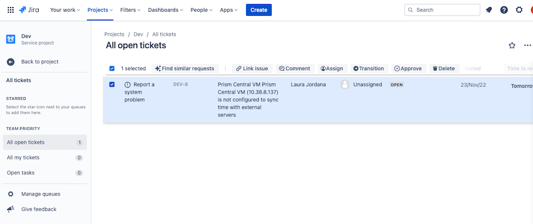
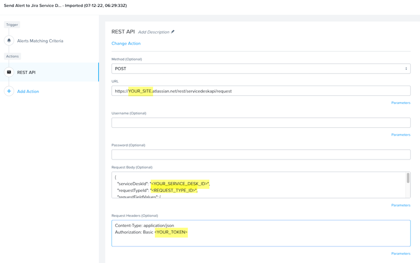
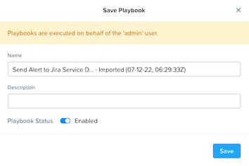

# Send Alert to Jira Service Desk

### Table of Contents
   - [Export Version](#export-version)
   - [Description](#description)
   - [Steps to Download/Enable](#steps-to-downloadenable)

### Export Version
<b>pc.2022.6.0.1</b> - This playbook can only be imported into pc.2022.6.0.1 or newer versions.

### Description
This playbook allows you to send any alert to Jira Service Desk.

### Steps to Download/Enable
1. Download the .pbk file by right-clicking and saving this link: https://raw.githubusercontent.com/nutanixdev/playbooks/master/send_alerts_to_jira/pc-2022-6-0-1-send-alert-to-jsd.pbk
2. Import the .pbk file into your Prism Central instance by clicking on Operations > Playbooks > Import.
2. If desired, update the trigger filter criteria to match only the alerts you care about.
3. Configure the REST API action to fill in the missing values.
    - URL: Replace `<YOUR_SITE>` with your specific site i.e. your-site.atlassian.net
    - Request Body: 
        - Replace `<YOUR_SERVICE_DESK_ID>` with your Service Desk ID
            - This can be obtained by doing a `GET` to `/rest/servicedeskapi/servicedesk`
        - Replace Enter in your desired Request Type ID
            - Possible request types can be obtained by doing a `GET` to `rest/servicedeskapi/servicedesk/1/requesttype`
        - For more information please see: https://developer.atlassian.com/cloud/jira/service-desk/
    - Headers
        - Replace `<YOUR_TOKEN>` with your authorization token, which is built by Base64 encoding the string `“user_name:password”`
        - Optionally you can remove this and just use the username and password fields
        - For more information please see: https://developer.atlassian.com/cloud/jira/service-desk/basic-auth-for-rest-apis/
        

        

4. Save and Enable

    

