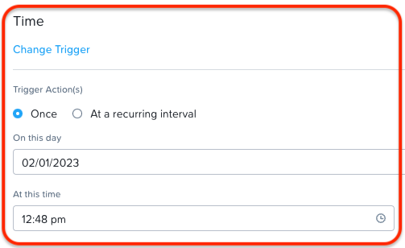
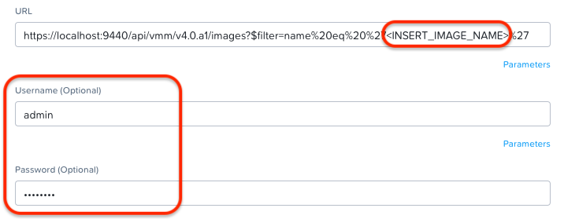
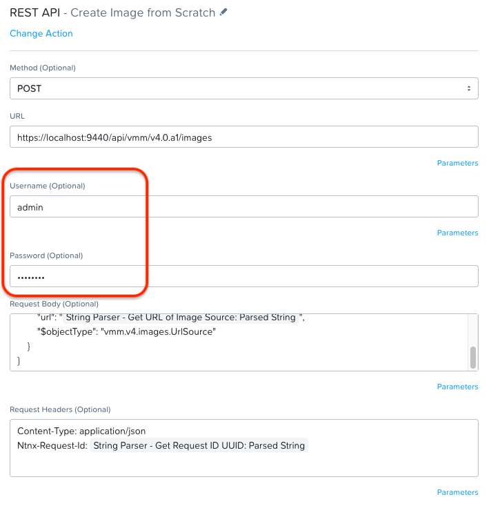
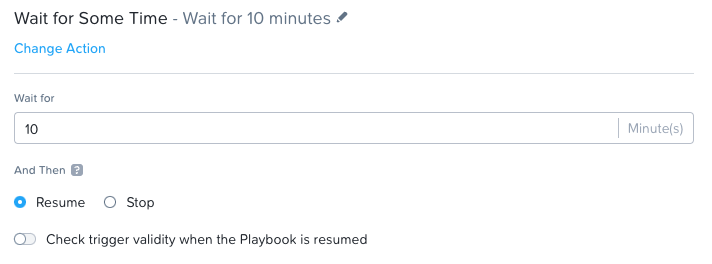
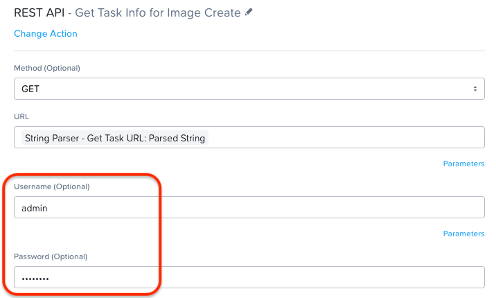
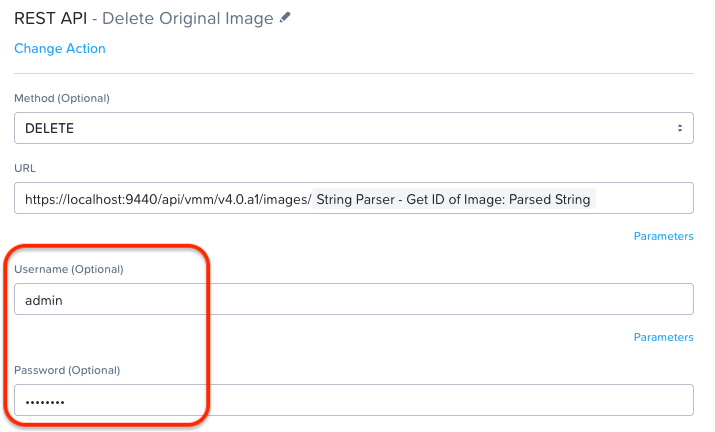
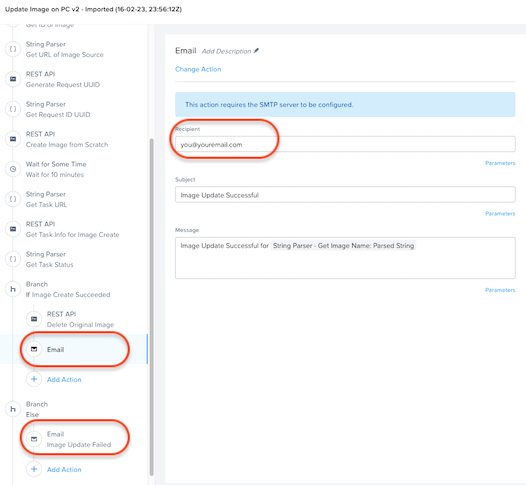
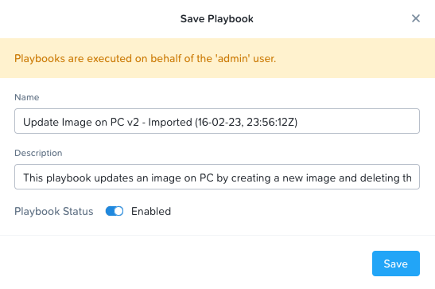

# Update PC Image

### Table of Contents
- [Table of Contents](#table-of-contents)
- [Export Version](#export-version)
- [Description](#description)
- [Steps to Download/Enable](#steps-to-downloadenable)

### Export Version
<b>pc.2022.6.0.1</b> - This playbook can only be imported into pc.2022.6.0.1 or newer versions.

### Description
This playbook runs on a schedule to update a given image on PC. It does the following:

* Makes an API call to get the image information for the image you want to update.
* Parses the API response body to get the ID of the image
* Parses the API response body to get the URL of the image source
* Makes an API call to generate a UUID (this is required for Nutanix v4 APIs, and enforced starting in pc.2022.9)
* Makes an API call to recreate the image from the URL, using the generated UUID in the headers as the Ntnx-Request-Id
* Wait 10 minutes to ensure the task was successful. (Depending on the size of your image you may want to modify this)
* Makes an API call to delete the existing image, if the task was successful.

### Steps to Download/Enable
1. Download the .pbk file by right-clicking and saving this link: https://raw.githubusercontent.com/nutanixdev/playbooks/master/update_pc_image/pc.2022.6.0.1_update_pc_image.pbk
2. Import the .pbk file into your Prism Central instance by clicking on **Operations > Playbooks > Import**.
3. Click on **Update**.
4. Update the trigger to the desired time interval. You can test the playbook by selecting to run the playbook **Once**, and selecting a time in the next few minutes.

    

5. Configure the REST API section - **Get Image By Name**
	
	We are using the v4 API to get the specific image we want to update.

    * URL: Replace <INSERT_IMAGE_NAME> with the image you want to update. Be sure to leave the surrounding instances of `%27` intact.
    * Username: Update with your PC username that has the necessary privileges
    * Password: Update with your PC password

        

6. Configure the REST API action - **Create Image from Scratch**
   * Username: Update with your PC username that has the necessary privileges
   * Password: Update with your PC password

        

7. *Optional:* Change the **Wait for Some Time** action to your desired time (currently set to 10 minutes).

    

8. Configure the REST API action - **Get Task Info for Image Create**
   * Username: Update with your PC username that has the necessary privileges
   * Password: Update with your PC password

        

7. Configure the REST API action - **Delete Existing Image**
   * Username: Update with your PC username that has the necessary privileges
   * Password: Update with your PC password

        

8. Change e-mail actions to reflect your e-mail address and desired text. You could also change these to other types of messaging actions (Slack, Teams, etc).

    

9.  Save and Enable

    

