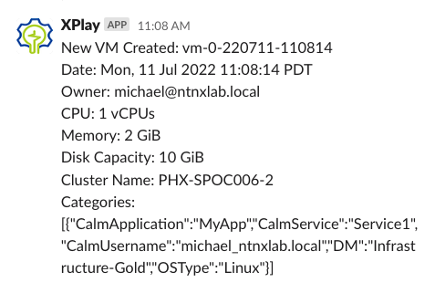
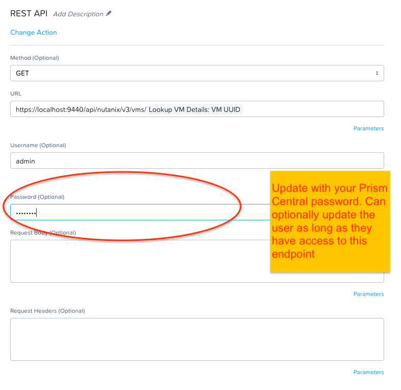
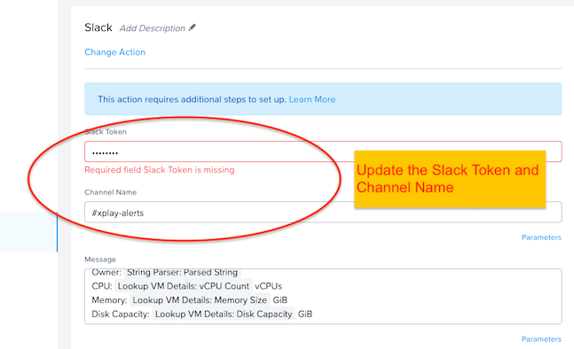

# VM Created Alert

### Table of Contents
   - [Export Version](#export-version)
   - [Description](#description)
   - [Steps to Download/Enable](#steps-to-downloadenable)
   - [Customization](#customization)

### Export Version
<b>pc.2022.4</b> - This playbook can only be imported into pc.2022.4 or newer versions.

### Description

This playbook sends a Slack message when a VM is created, with the user and VM details. It uses the Lookup VM Details, REST API, and Slack actions. It could easily be modified to support Microsoft Teams as well.

### Steps to Download/Enable
1. Download the .pbk file by right-clicking and saving this link: https://raw.githubusercontent.com/nutanixdev/playbooks/master/vm_created_alert/pc-2022-4-vm-created-alert.pbk
2. Import the .pbk file into your Prism Central instance. The playbook will have validation errors. This is expected as you will need to update the Slack action to use your specific Slack token and channel name. 
3. Click on the playbook name, then click **Update**
4. Click on the REST API action and update the password field with your Prism Central password. You can optionally update the username as well, as long as that user has access to this API endpoint.

   

5. Click on the Slack action, then update the Slack Token and Channel Name. Please see the [Prism Central Guide](https://portal.nutanix.com/page/documents/details?targetId=Prism-Central-Guide-Prism-vpc_2022_4:mul-playbook-actions-pc-r.html) for more details.

   

### Customization
You can customize the playbook to suit your needs. For example, you can enable Microsoft Teams support by removing the Slack action and replacing with the Teams action. Be sure to save and enable the playbook once you are done customizing.